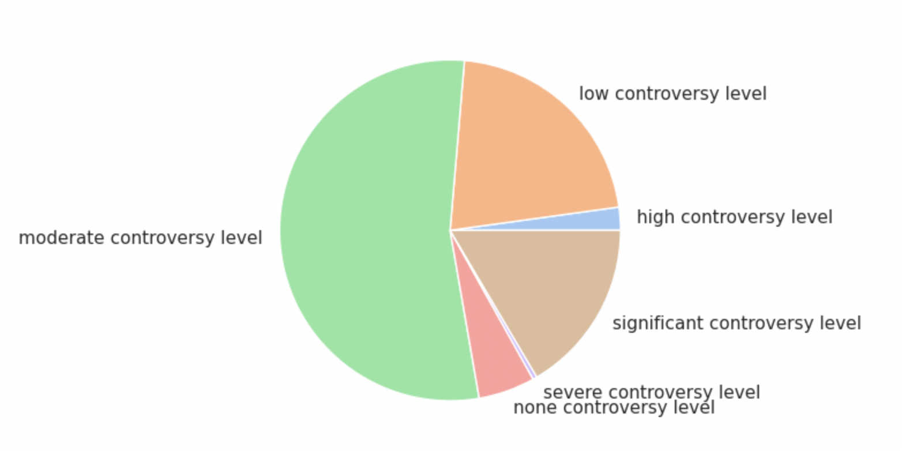

# ESG Data Analysis Project

---

## Overview
This project is built to integrate ESG knowledge with practical analytics. I designed this ESG Data Analysis Project after completing all six courses of the Coursera ‘ESG for All’ Specialization. The project reflects my ability to apply ESG principles to real-world data, highlighting both my analytical skills and my strategic approach to sustainability insights.

This project analyzes a **(Kaggle ESG dataset)[https://www.kaggle.com/datasets/pritish509/s-and-p-500-esg-risk-ratings]** to examine S&P top 100 companies' ESG performance.

It demonstrates **data cleaning, imputation, exploratory data analysis (EDA), and visualization**, linking findings to ESG principles learned in the *“ESG for All”* Coursera Specialization.

---

## Project Objectives:
1. **Examine overall ESG risk profiles**  
2. **Identify top and bottom ESG performers**  
3. **Compare ESG dimension scores (E, S, G) across sectors**  

---

## Dataset
- Contains 503 companies with ESG metrics, sector, industry, employee count, and controversy levels.  
- Key variables: `Total ESG Risk Score`, `Environment Risk Score`, `Social Risk Score`, `Governance Risk Score`, `Controversy Level`, `Full Time Employees`, `Description`.

---

## Analysis Steps
1. **Data Loading & Cleaning**
   - Imported libraries, explored dataset head and info
   - Imputed missing values (mean for numerical, mode for categorical)
   - Checked distributions and outliers

2. **Exploratory Data Analysis (EDA)**
   - Visualized **Total ESG Risk Score** (Histogram, Boxplot, Violin)  
   - Pie chart for **Controversy Level** distribution  
   - **Word cloud** for company descriptions (common terms)  
   - Identified **Top and Bottom ESG performers**  

3. **Sector-wise ESG Analysis**
   - Grouped companies by sector  
   - Calculated average **Environment, Social, Governance** scores  
   - Plotted **dimension-wise comparison across sectors**  
   - Analyzed **average employee count** per sector to highlight social factor influence  

---

## Key Insights
- Most companies have **moderate ESG risk**; few are high-risk outliers  
- Top performers: tech, real estate, services (lowest risk)  
- Bottom performers: energy and industrial sectors (highest risk)  
- **Environmental risk**: highest in Energy & Utilities  
- **Social risk**: varies across sectors; larger workforces indicate potential impact of social initiatives  
- **Governance risk**: relatively stable across sectors  

---
## Visuals: Some images from the project:

### Distribution of Total ESG Risk Scores

---
### Top and Bottom ESG Performers

---

### Controversy Level Distribution

---

### Average ESG Dimension Scores by Sector

---

