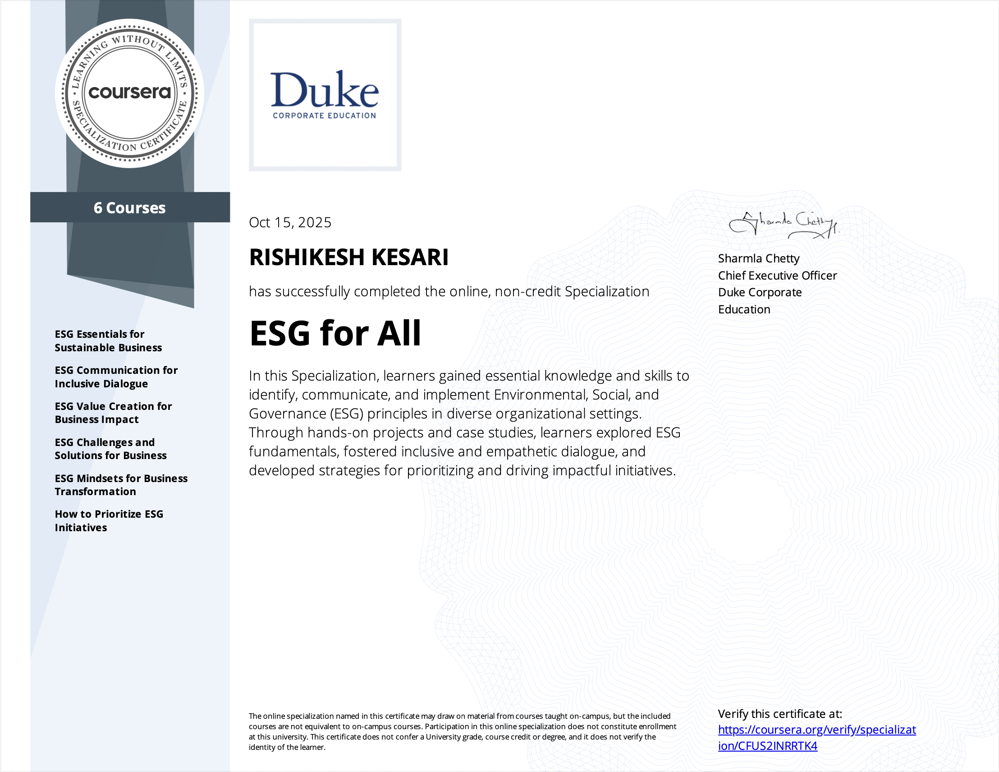

# ESG for All — Coursera Specialization Portfolio

    

---

## Overview
This repository contains my **portfolio work** for the "ESG for All" Coursera Specialization.  
It includes concise summaries of all six courses and a **practical ESG data analysis project** using a Kaggle dataset. The project demonstrates application of ESG principles through **data cleaning, visualization, and interpretation**, connecting analytical insights to ESG concepts.

---

## Coursera Specialization Courses
1. **ESG Essentials for Sustainable Business**  
2. **ESG Communication for Inclusive Dialogue**  
3. **ESG Value Creation for Business Impact**  
4. **ESG Challenges and Solutions for Business**  
5. **ESG Mindsets for Business Transformation**  
6. **How to Prioritize ESG Initiatives**

> Each course summary is included as a concise Markdown file in the `Courses/` folder.

---

## ESG Data Analysis Project
The project analyzes a Kaggle ESG dataset to:  
- Examine overall ESG risk profiles  
- Identify top and bottom ESG performers  
- Compare Environmental, Social, and Governance risk across sectors
[Link to the project page](https://github.com/rishi-analytics/ESG-Specialization-Project-Portfolio/tree/main/ESG_Data_Analysis_Project)

**Key Features:**  
- Data cleaning and imputation  
- Exploratory Data Analysis (EDA) with interactive and static visualizations  
- Word cloud of company descriptions  
- Sector-wise ESG dimension comparison  
- Insights aligned with ESG course learnings

**Colab Notebook:** [`ESG_Project/ESG_Analysis.ipynb`](https://colab.research.google.com/drive/1PaCj1ZqyIKQExJzV0P7IMA89szjhyufY#scrollTo=81fvns2i5EVY)

---

## Repository Structure
ESG-for-All-Coursera/
│
├─ README.md               # Main repo overview with badges, courses, and project links
├─ Courses/
│   ├─ 01_ESG_Essentials.md
│   ├─ 02_ESG_Communication.md
│   ├─ 03_ESG_Value_Creation.md
│   ├─ 04_ESG_Challenges.md
│   ├─ 05_ESG_Mindsets.md
│   └─ 06_ESG_Prioritization.md
├─ ESG_Project/
│   ├─ ESG_Analysis.ipynb  # Colab notebook
│   └─ README.md           # Optional: project-specific README for details
└─ assets/                 # images, plots, word cloud, etc.
